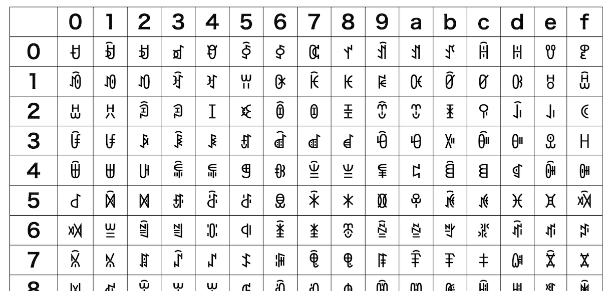

# Base1024Y Yi-encode encoding/decoding ES module for JavaScript

- Base1024Y is an ES module for Yi-encode, 10bit encoding with [Yi script](https://en.wikipedia.org/wiki/Yi_script)([彝文字](https://ja.wikipedia.org/wiki/%E5%BD%9D%E6%96%87%E5%AD%97)) (0xa000-0xa3ff in unicode)



[Base1024Y Yi-encode char map](https://code4fukui.github.io/Base1024Y/)

One of the primary purposes is to have aesthetically pleasing SHA1 hashes. Compare:

- Hex:    `17057684bea1f9331418b633a8f373119d765fd4`
- B64:    `FwV2hL6h+TMUGLYzqPNzEZ12X9Q=`
- B32:    `RJ56_U1WM_LTT5_3TQH_K4P0_YJ4L_UTKD_3ZZZ_ZW`
- B16384: `叕蒄綨涓婐暶嫪崷婆歶旴`
- B256B:  `⣰⢐⡶⠑⡽⢅⣏⣤⡐⡈⡵⣤⠍⣧⣦⣀⣙⡶⣺⡓`
- B1024Y: `ꁜꁗꆡꂾꊇꎓꃅꀘꋘꌺꈼꍳꁆꇗꆗꏔ`

## Getting started

In your code:

```javascript
import { Base1024Y } from "https://code4fukui.github.io/Base1024Y/Base1024Y.js";

const encoded = Base1024Y.encode(new Uint8Array([1, 2, 3, 4]));
console.log(encoded);
const decoded = Base1024Y.decode(encoded);
console.log(decoded);

const key = new Uint8Array(32); // 32byte -> 26chars
crypto.getRandomValues(key);
const encoded2 = Base1024Y.encode(key);
console.log(encoded2); // ꇷꆁꊳꊙꂜꂡꋮꀬꅶꂟꇾꇳꃛꇾꃅꇖꏙꌨꎫꁑꅒꂁꇗꂎꅏꀠ
```

## reference

- [Base256B](https://github.com/code4fukui/Base256B)
- [Yi script](https://en.wikipedia.org/wiki/Yi_script)([彝文字](https://ja.wikipedia.org/wiki/%E5%BD%9D%E6%96%87%E5%AD%97))
